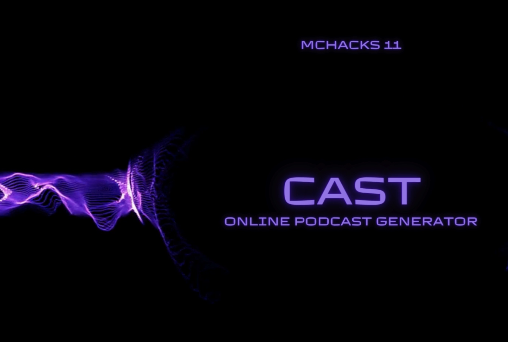

# Cast

- A Podcast generator for celebrity personalities




# Setup

- Clone the repo
`git clone https://github.com/Yianni-Zav/PodcastGPT.git`

- Setup virtual environment
```
virtualenv .venv
source .venv/bin/activate
pip install -r requirements.txt
```

- Run the app
`python3 app.py`

# Requests

- Curl reques example
- This make a test call to the api. It should download a demo.mp4 file into the current directory
```
curl --location --request POST 'http://10.121.221.183:5002/cast' --output demo.mp4
```


- The url for local testing is 
- `http://127.0.0.1:5002/cast`

- The url for LAN testing will look something like this
- `http://10.121.221.183:5002/cast`

# CAST API

`http://<ip:5002>/cast`
### POST 

Request:
```
{
        "guest": "personality_1",
        "host": "personality_2",
        "topic": "topic",
        "duration": 5
}
```

Response:
```
{
    "duration": 5,
    "guest": "personality_1",
    "host": "personality_2",
    "topic": "topic",
    "video_url": "http://127.0.0.1:5002/static/podcasts/JoeRoganBenShapiro.mp4"
}
```


### GET Request

Request:
```
~
```
Response:
```
{
    "barack_obama": "http://127.0.0.1:5002/static/profiles/barack_obama.jpg",
    "ben_shapiro": "http://127.0.0.1:5002/static/profiles/ben_shapiro.jpg",
    "donald_trump": "http://127.0.0.1:5002/static/profiles/donald_trump.jpg",
    "elon_musk": "http://127.0.0.1:5002/static/profiles/elon_musk.jpg",
    "joe_biden": "http://127.0.0.1:5002/static/profiles/joe_biden.jpg",
    "joe_rogan": "http://127.0.0.1:5002/static/profiles/joe_rogan.jpg"
}
```

# Client

- to go to the frontend website go to the following url
- replace the ip address with the ip address of the server
- `http://127.0.0.1:5002/client/index.html`


# Hosting

- To host the server and make it public outside the local network we are using are portforwarding using a tunnel service called ngrok

- To install ngrok on mac
```
brew install ngrok/ngrok/ngrok
```
- sign up for a free account on ngrok.com: 

- Get your auth token from the ngrok dashboard
- authenticate your account on your local machine
```
ngrok config add-authtoken <auth-token-goes-here>
```

- Now to start up the server and make it public
- take note of the port the server is running on
- in this case it is 5002
- Then run the following command to expose the port
```
ngrok http 5002
```
- This will open up a tunnel to the port 5002 on your local machine and it should display a dashboard with the url to access the server. Use this url to make requests to the server from outside the local network


# Profile image cropping

- to crop the profile images to a square use the following command
```
ffmpeg -i lex_fridman.jpg -vf "scale='if(gt(iw/ih,1),512*(iw/ih),512)':'if(gt(iw/ih,1),512,512*(ih/iw))',crop=512:512" lex_fridman1.jpg
```

